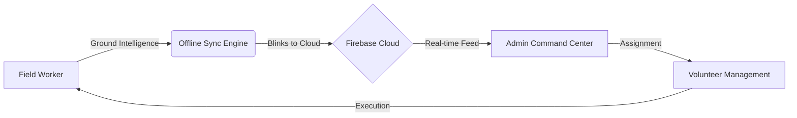

# 🚀 ImpactPulse
### *The Mission Command for Humanitarian Precision*


---

## 🌪️ Problem Statement
In the wake of natural disasters or humanitarian crises, NGOs and first responders face a critical **"Information Lag."** 

### The Core Issues:
*   **NGO Data Fragmentation**: Ground intelligence is often stuck in WhatsApp groups or paper forms, creating silos where data is disconnected from action.
*   **Delayed Response Due to Connectivity**: Traditional cloud apps fail in "Zero-Signal" zones, meaning the most critical areas stay dark while the internet is down.
*   **The "Unseen" Crisis**: Aid often flows to the loudest or most accessible areas, leaving remote or less communicative regions—**Neglected Zones**—without a single pulse of help.

---

## 💡 The Solution
**ImpactPulse** is an end-to-end operational platform designed to bridge the gap between field sensors (people) and command centers. It transforms raw ground reports into actionable intelligence through a three-pillared approach:

1.  **Offline-First Resilience**: A local-first synchronization engine that ensures data is captured even in the heart of a disaster.
2.  **Predictive Mission Logic**: Client-side heuristics that analyze report descriptions to auto-classify emergencies and prioritize lives.
3.  **Role-Based Dynamic Command**: A unified workflow that connects Admins, Volunteers, and Field Workers in a real-time feedback loop.

---

## ✨ Key Features

### 📡 Offline Data Collection + Auto Sync
Field Workers can submit complex surveys (Problem types, GPS, Severity) without any internet connection. The app caches data in a local **IndexedDB "Hub,"** which automatically detects a signal and beams data to the cloud the moment it's available.

### 🧠 Predictive Need Detection
Every submitted report is scanned by our intelligence engine. Keywords like *"severe bleeding,"* *"starvation,"* or *"infrastructure collapse"* trigger an automatic "High Priority" flag, bypassing manual sorting and saving precious minutes.

### 🤝 Smart Volunteer Assignment
Admins can oversee the entire available workforce and delegate high-priority tasks to specific Volunteers based on their region, optimizing resource allocation.

### 🔍 Neglected Area Detection
The system continuously monitors regional data to identify **"Intelligence Gaps"**—districts where personnel are present but zero tasks are being executed. This prevents aid from being concentrated only in certain hubs.

### 📈 Impact Scoring & Analytics
Our dashboard calculates a real-time **Impact Score** (Recovery Rate) based on the ratio of People Affected vs Help Provided, giving NGOs a single number to measure their operational success.


---

## 🛠️ Tech Stack
| Tier | Technology |
| :--- | :--- |
| **Frontend** | React 19, TypeScript, Vite |
| **Backend** | Google Cloud Firestore (Live Document Store) |
| **Storage** | IndexedDB (LocalSync Engine via `idb`) |
| **Authentication** | Firebase Auth (Google SSO + Secondary Password Layer) |
| **APIs** | navigator.geolocation API, Google Cloud SDK |

---

## 📁 Repository Structure

```text
ImpactPulse/
├── frontend/ (Core Application)
│   ├── src/
│   │   ├── components/  # Reusable UI (Cards, Buttons, Modals)
│   │   ├── config/      # Firebase & Cloud configuration
│   │   ├── pages/       # Role-specific Dashboards & Auth
│   │   ├── services/    # Offline Sync & Intelligence Engine
│   │   └── store/       # Zustand Global State Management
│   └── public/          # Static Assets
├── backend/
│   └── firestore.rules  # Cloud Security Policies
├── docs/
│   ├── ARCHITECTURE.md  # Deep technical breakdown
│   └── DEMO_SCRIPT.md   # Step-by-step narration guide
├── .env.example         # Configuration template
└── README.md            # Submission overview
```

---

## 🏗️ System Architecture & Workflow

### The Workflow Loop:
1.  **Admin (Commader)**: Sets up Regional Hubs, approves personnel, and monitors the "Neglected Area" map.
2.  **Volunteer (Manager)**: Receives regional alerts and monitors field worker activity.
3.  **Field Worker (Sensor)**: Operates at the ground level, submitting offline surveys and executing assigned tasks.



---

## 🚀 How to Run Locally

### 1. Project Initialization
```bash
# Clone the repository
git clone https://github.com/your-username/ImpactPulse.git

# Move into the app directory
cd ImpactPulse/frontend

# Install dependencies
npm install
```

### 2. Environment Setup
Create a file named `.env` in the `frontend/` directory. Copy the contents of [.env.example](.env.example) and fill in your Firebase API keys.

### 3. Launch
```bash
# Start dev server
npm run dev
```

---

## 🎥 Demo & Media
- **Demo Link**: [Click here for the 2:30 min Walkthrough] (Placeholder)

Created for the **Hack2Skill Hackathon** by **Team ImpactPulse**.
