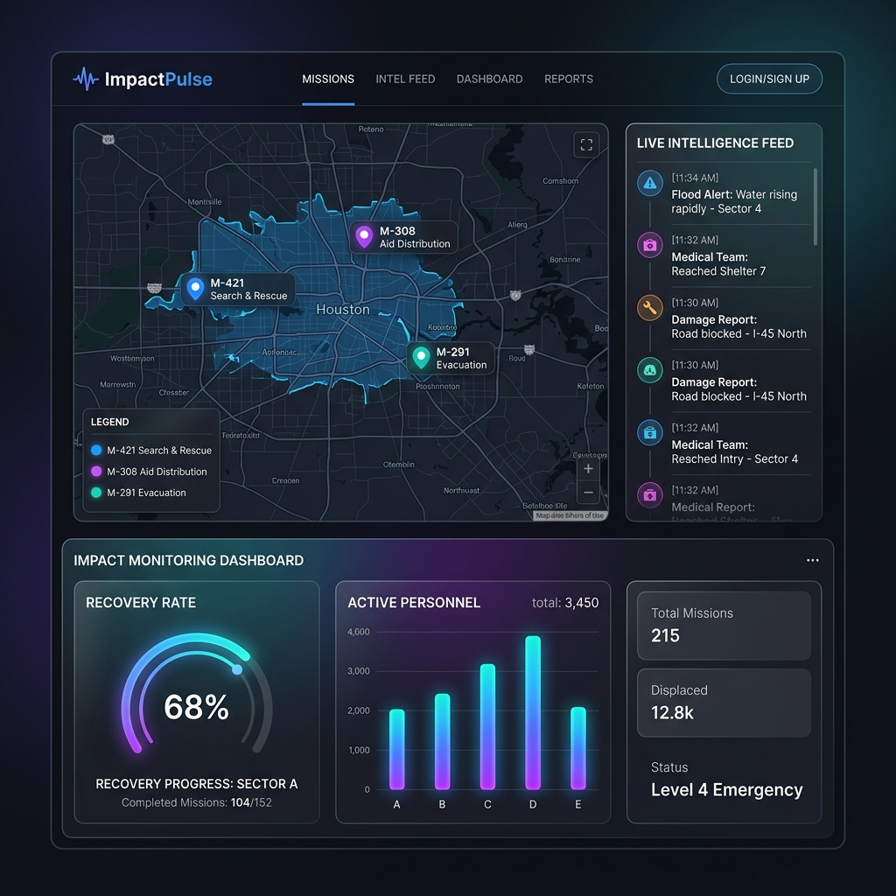
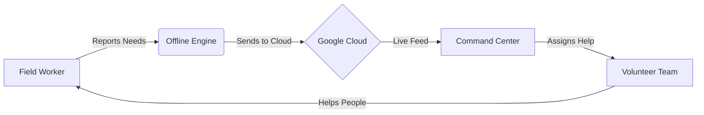

# 🚀 ImpactPulse
### *Smart Relief System*

[](https://reactjs.org/)
[](https://firebase.google.com/)
[](https://vitejs.dev/)
[](https://github.com/pmndrs/zustand)
[](https://hack2skill.com/)



---

## 🌪️ The Problem
When a disaster happens, information is the most important thing. But right now, NGOs face three big problems:
*   **NGO Data Fragmentation**: Information is scattered in many places and teams can't talk to each other.
*   **Delayed Response**: Most apps stop working if the internet or cell towers are down.
*   **The Unseen Crisis**: Aid often goes to the same easy-to-reach places, while people in remote areas stay "hidden" and get no help.

---

## 💡 Our Simple Solution
**ImpactPulse** is an all-in-one command center that helps rescue teams work together perfectly. It works without internet, automatically sorts the most urgent needs, and makes sure no region is forgotten.

---

## ✨ Key Features

### 📡 Works Without Internet (Auto Sync)
Field workers can fill out reports even with ZERO phone signal. The app saves everything and "blinks" the data to the cloud automatically the moment they find a signal.

### 🧠 Smart Priority Sorting
The app automatically scans reports for urgent words like "Emergency" or "Severe." It then flags those reports as **Red Alerts** so the team can help the most vulnerable people first.

### 🔍 Find Forgotten Zones
The app highlights areas on the map that have zero help on the way. This makes sure that rescue teams don't just go to the same places, but find every person who needs help.

### 📈 Impact Scoring
A simple live chart shows the "Recovery Rate"—how many people have been rescued vs. how many still need help.

---

## 🏗️ How it Works (Structure)



---

## 📁 Repository Structure
```text
ImpactPulse/
├── frontend/ (The Web App)
│   ├── src/
│   │   ├── components/  # Buttons, Tabs, & Navigation
│   │   ├── pages/       # Different screens for Workers & Admins
│   │   ├── services/    # The "Offline" magic engine
│   │   └── store/       # Where data is kept safe
├── backend/
│   └── firestore.rules  # Security policies
├── docs/
│   ├── ARCHITECTURE.md  # How the tech works
│   └── DEMO_SCRIPT.md   # How to show the app
└── README.md            # You are here!
```

---

## 🛠️ Tech Stack
| Job | Technology We Used |
| :--- | :--- |
| **Frontend** | React & Vite (for speed) |
| **Database** | Google Cloud Firestore (for syncing) |
| **Offline Storage** | IndexedDB (to work without internet) |
| **Security** | Google Login (to keep accounts safe) |
| **Interactive Map** | Leaflet JS (to see where help is needed) |

---

## 🚀 How to Run Locally

### 1. Installation
```bash
# Go into the app folder
cd ImpactPulse/frontend

# Install the app
npm install
```

### 2. Setup
Create a file named `.env` in the `frontend/` folder. Use our `.env.example` to see which keys you need to add from your own Firebase project.

### 3. Run
```bash
# Start the app
npm run dev
```

---

## 🎥 Demo Video
[Link to Video Placeholder]  
*Credentials for your demo:*
- **Email**: `admin@ngo.org`
- **Password**: `demo123`

---

*Team ImpactPulse - Built with ❤️ for the Hack2Skill Hackathon.*
